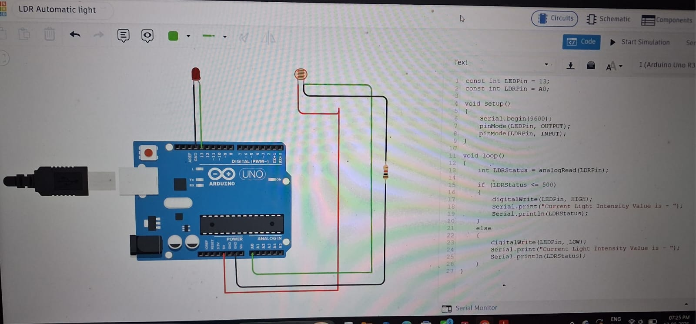
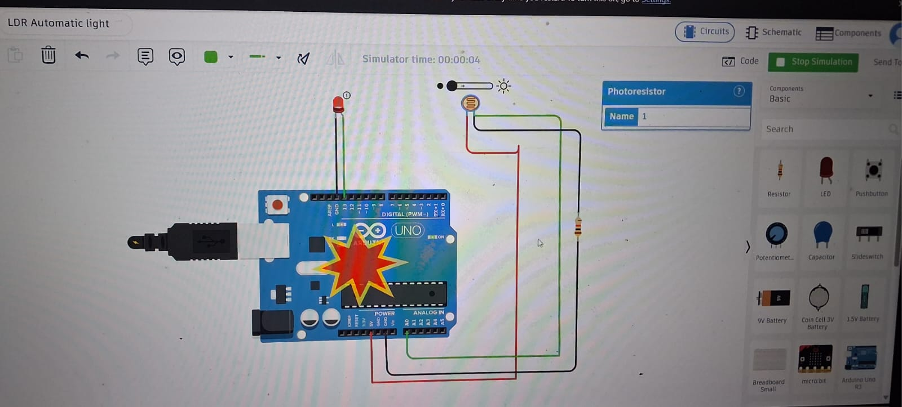

# LDR Automatic Light – Task 2

## 📌 Project Overview

This project demonstrates an **LDR Automatic Light System using Arduino Uno**. The LDR detects the surrounding light intensity, and the Arduino automatically controls an LED according to the detected light condition.

## 🎯 Objective

To design and simulate an automatic lighting system using an **LDR (Light Dependent Resistor)** and **Arduino Uno**, where the LED automatically responds to changes in light intensity.

## 🔧 Components Used

- Arduino Uno
- LDR (Light Dependent Resistor)
- LED
- Resistor
- Jumper Wires
- Power Supply

## ⚙️ Working

The LDR senses the surrounding light intensity and provides an analog value to the Arduino through **Analog Pin A0**.

The Arduino compares the LDR reading with a predefined threshold and controls the LED accordingly.

- **Light detected:** LED responds according to the sensor reading.
- **No light detected:** LED turns ON automatically.
- The LDR value can also be monitored through the Serial Monitor.

## 🔌 Pin Connections

| Component | Arduino Pin |
|---|---|
| LED | Digital Pin 13 |
| LDR | Analog Pin A0 |
| LDR Circuit | 5V and GND |

## 📷 Project Images

### Circuit Diagram

### Light Detected – LED Response

### No Light Detected – LED OFF

## 🛠️ Tool Used

Online Arduino Circuit Simulator

## 📚 Internship Task

**Task 2 – LDR Automatic Light**
